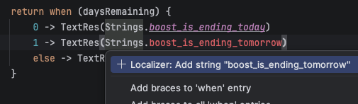
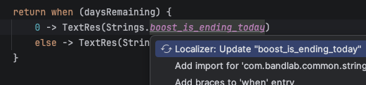
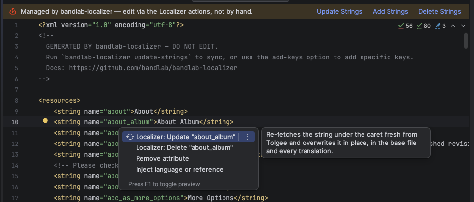
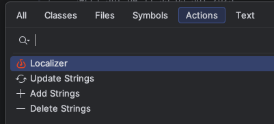
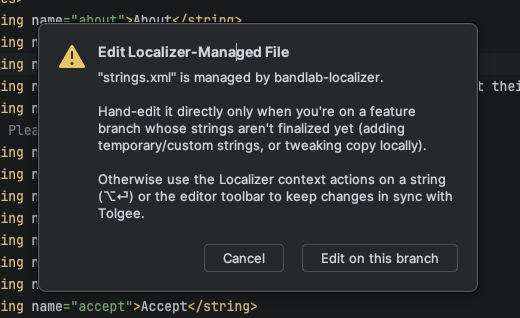
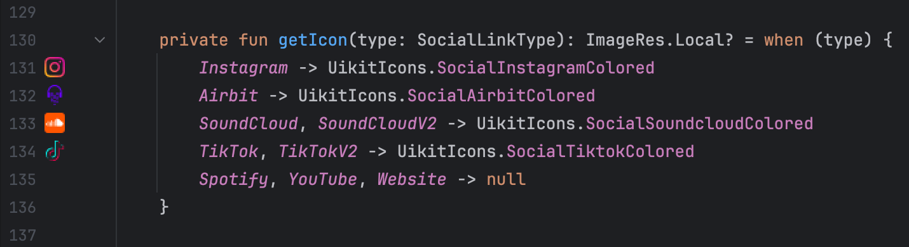

# BandLab Android IntelliJ Plugin

[](https://github.com/bandlab/bandlab-android-intellij-plugin/actions/workflows/build.yml)

[](https://www.apache.org/licenses/LICENSE-2.0)

<!-- Plugin description -->

This plugin offers a suite of features to help developers work more efficiently with the BandLab Android project.

Please note that this plugin is not available for external use; we've open-sourced it solely to demonstrate our approach to improving develop experience through IDE integration.

## Module Creation


**The UI is implemented using [Jewel](https://github.com/JetBrains/intellij-community/tree/master/platform/jewel) (Compose Desktop)!** 🔮

- Create modules following BandLab Android conventions (:api, :impl, :ui, :screen).
- Support for batch creation of multiple modules.
- Contextual module path pre-filling and autocomplete.
- Optional `:impl` and `:screen` exposure to `AppGraph` (default) or `MixEditorGraph`.
- Templates for Activities and Pages.
- Support adding to spotlight after creating modules.

---

## Templates


### Page Template
Generates Page and ViewModel.

_Notes: Page is our internal framework to render a Composable with a given injected ViewModel type._

```kotlin
interface Page<ViewModel : Any> {

    @Composable
    fun Content(viewModel: ViewModel)
}
```

### Composable Template
Generates a Composable with a State class and Preview.

```kotlin
@Immutable
data class ProfileHeaderState(
    // TODO: Params you need for your Composable state
) {
    companion object {
        @ComposePreviewApi
        fun preview(): ProfileHeaderState = ProfileHeaderState(
            // TODO: Default values for the state preview
        )
    }
}

@Composable
internal fun ProfileHeader(
    state: ProfileHeaderState,
    modifier: Modifier = Modifier,
) {
    
}

@PreviewDayNight
@Composable
private fun ProfileHeader_Preview() {
    ProfileHeader(
        state = ProfileHeaderState.preview(),
    )
}
```
_Notes: `@ComposePreviewApi` is a custom lint check to make sure you don't use the preview state in production code._

### Two-level Injection template
Generates an interface and an impl for two-level injection.

_Notes: Two-level injection is useful when you have both app-level and screen-level dependencies for a class whose dependencies you want to invert.
In such cases, you can avoid manually passing screen-level dependencies. 
There are two factories: a screen-level factory and an app-level factory, like this:_
```kotlin
interface FeatureViewModel {
    val state: FeatureState
    
    @Inject
    class Factory(
        private val coroutineScope: CoroutineScope,
        private val appLevelFactory: AppLevelFactory,
    ) {
        fun create(
            params: FeatureParams,
        ): FeatureViewModel = appLevelFactory.create(
            params = params,
            coroutineScope = coroutineScope
        )
    }
    
    interface AppLevelFactory {
        fun create(
            params: FeatureParams,
            coroutineScope: CoroutineScope,
        ): FeatureViewModel
    }
}
```

### Automation Templates


Generate Robot, Semantics, and Verifier templates following our automation conventions. Available only under the `androidTest` source set.

---

## Module Analyzer


Right-click a module to analyze it using [DAGP](https://github.com/autonomousapps/dependency-analysis-gradle-plugin) and our internal scoring plugin (predicts JVM module compatibility).

The plugin helps invoke these tasks in your IDE's Run tab:
- **Android modules:** `./gradlew :module:analyzeModule`
- **Non-Android modules:** `./gradlew :module:projectHealth`

---

## Jenkins Test Run

Trigger the Jenkins UI test build straight from the IDE, instead of opening Jenkins and filling in the parameters by hand.

Right-click a Kotlin file under an Android test directory (`src/androidTest/`) that contains tests, and choose **Configure Jenkins Test Run**. A dialog opens where you build the run and send it.


- **Pick tests with checkboxes.** Test classes and their methods are shown as a tree — select a whole class or individual methods. The resulting `targets` JSON is shown live and can be copied.


- **Select across multiple files.** Your selection is kept when you close the dialog, so you can open another test file and add more tests; everything accumulates into one `targets` list. Use **Clear** to reset it.
- **Smart defaults.** `branch` and `user` are pre-filled from your local git config.
- **Device options.** For `devices`, choose **Default** to use the value configured on the Jenkins job, or **Custom** to provide your own JSON.

**First-time setup.** The first time you press **Send to Jenkins**, you're asked to connect: use **Open token page…** to generate a Jenkins API token (you're already signed in there via Google), paste it, and click **Save**. The username is pre-filled from your git config — update it if it doesn't match your Jenkins account. The token is stored securely in the IDE's password storage, so this is a one-time step.


After sending, a notification with an **Open in Jenkins** link points to the job page, where your new build appears at the top.

---

## Localization Strings

Add, update, and delete localization keys without hand-editing string resources — every action shells out to `./localizer/bandlab-localizer`, which owns merging, validation, and multi-locale output. Available whenever `bandlab-localizer-config.toml` resolves (no Gradle sync needed).

**Add a key that doesn't exist yet.** On an unresolved reference (`Strings.foo` / `R.string.foo`), Alt+Enter → **Localizer: Add string** pulls it from Tolgee into the right module's file.



**Update an existing key in place.** On a defined `Strings.foo` / `R.string.foo` reference, Alt+Enter → **Localizer: Update** re-fetches just that key — no full re-sync.



**Work from the string file.** Open a managed `strings.xml` / `strings-plurals.xml`: a banner links to the actions, and Alt+Enter on a `<string>` offers **Update** / **Delete** for that one key.



**Run an action from anywhere.** Find Action (or the Localizer menu) → **Update / Add / Delete Strings**, choosing the target file.



**Hand-editing is gated, not blocked.** Typing into a managed file prompts you to use the actions instead; choose *Edit on this branch* to proceed anyway (remembered per Git branch — e.g. a feature branch with un-finalized strings).



---

## UikitIcons Gutter Previews

Shows the drawable icon inline in the editor gutter when referencing `UikitIcons` properties, including extension properties that delegate to `UikitIcons`.



---

## build.gradle Actions


### Dependency Sorting
Right-click `build.gradle` to sort plugins and dependencies alphabetically.

### Test Fixtures Plugin
Right-click `build.gradle` to apply the Test Fixtures plugin and automatically create the required folders.

### Project Path Autocomplete


Since we avoid Gradle [type-safe accessors](https://www.zacsweers.dev/dont-use-type-safe-project-accessors-with-kotlin-gradle-dsl/), this plugin provides autocomplete and validation for project paths. Invalid paths are highlighted with a red underline.

_Acknowledgments: The feature was adapted from [Slack foundry](https://github.com/slackhq/foundry/pull/1440)._

<!-- Plugin description end -->

---

License
-------

    Copyright 2026 BandLab Singapore Pte Ltd

    Licensed under the Apache License, Version 2.0 (the "License");
    you may not use this file except in compliance with the License.
    You may obtain a copy of the License at
    
    http://www.apache.org/licenses/LICENSE-2.0
    
    Unless required by applicable law or agreed to in writing, software
    distributed under the License is distributed on an "AS IS" BASIS,
    WITHOUT WARRANTIES OR CONDITIONS OF ANY KIND, either express or implied.
    See the License for the specific language governing permissions and
    limitations under the License.

Plugin based on the [IntelliJ Platform Plugin Template][template].

[template]: https://github.com/JetBrains/intellij-platform-plugin-template
[docs:plugin-description]: https://plugins.jetbrains.com/docs/intellij/plugin-user-experience.html#plugin-description-and-presentation